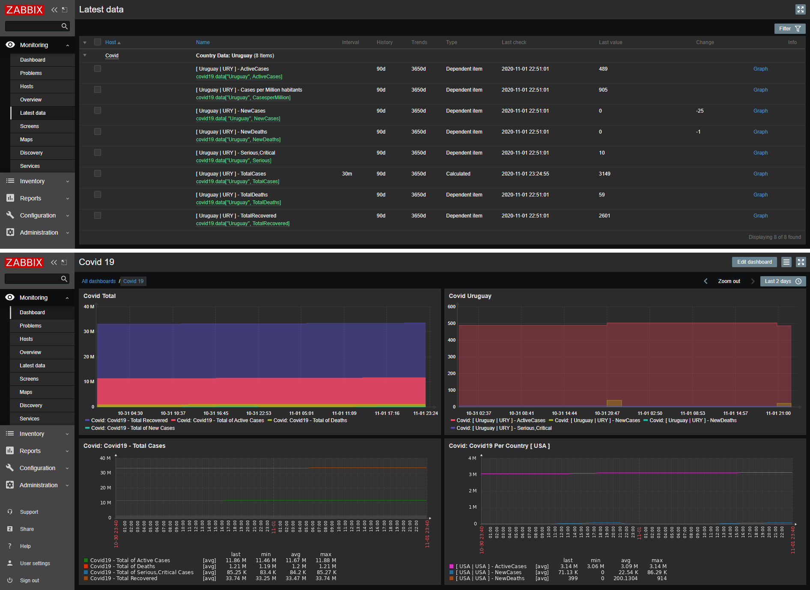

# zabbix-covid19-monitor
Gets statistics of COVID19 - CORONAVIRUS and presents to JSON and Zabbix


### Update
This is a fork of https://github.com/rickkbarbosa/covid9-monitor repo.  
Updated Python scripts to work properly with current table provided by worldometers.info as it was no longer working as it was due to changes in the request url.  
To speed up the script execution time i removed all the non needed html from the response, this saved 20secs worth of process in my Raspi 3+.  
Also this was fully tested with Zabbix 5.0 and Python 3.7. Unfortunately I do not use Grafana so I couldnt test the dashboard.  
All credits to [rickkbarbosa] for the idea and work.


### Usage

```
git@github.com:creizlein/zabbix-covid19.git
pip install -r requirements.txt
```


### To Zabbix

* Clone repository in a plase acessible by Zabbix (usually, /usr/lib/zabbix/externalscripts)
* Install python requirements on requirements.txt
* Import template to zabbix dashboard (zabbix_template.xml - Zabbix server 4.0 and above)
* Add template to a host




## Additional adjustment on Zabbix 4.0.x versions:

Zabbiux 4.0.x contains a limitation involving number of dependendant items.  
A proposed workaround was sugested by [@hardwareadictos](https://github.com/rickkbarbosa/covid9-monitor/issues/10):

* Change _/usr/share/zabbix/include/defines.inc.php:define('ZBX_DEPENDENT_ITEM_MAX_COUNT', 999)_; to 2999. 

### To Grafana

* Install Zabbix Plugin datasource by [Alexander Zobnin](https://grafana.com/grafana/plugins/alexanderzobnin-zabbix-app)
* Install Worldmap Panel plugin(https://grafana.com/grafana/plugins/grafana-worldmap-panel/installation)
* Install Polystat Grafana plugin(https://grafana.com/grafana/plugins/grafana-polystat-panel/installation)
* Install Multistat Grafana plugin(https://grafana.com/grafana/plugins/michaeldmoore-multistat-panel)
* Install Pie Chart plugin(https://grafana.com/grafana/plugins/grafana-piechart-panel)
* Import dashboard _grafana_dashboard.json_ to grafana 
* Points your Zabbix datasource


### License

See LICENSE


### Thanks 

* [rickkbarbosa] For the initial work and idea.
* [Zabbix Brasil](https://t.me/ZabbixBrasil) , for reviews and help with cleanup/garbage collecting
* Everaldo Santos Cabral, for Suggested applications organiztions and Zabbix 4.0 retro-compatible template
* [MrBits](https://github.com/mrbitsdcf)

